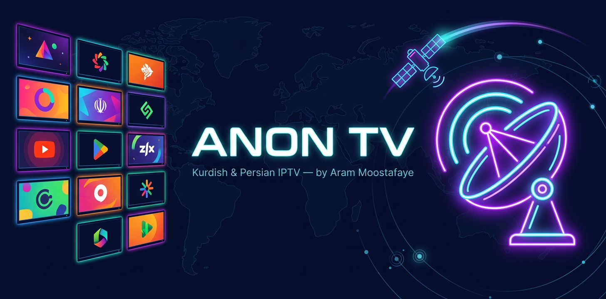

<p align="center">
  
</p>

<h1 align="center">📡 Anon TV — IPTV</h1>
<p align="center">
  <b>Auto-updated IPTV playlist focused on Kurdish and Persian TV</b><br>
  by <b>Aram Moostafaye</b> •
  <a href="https://github.com/arammoostafaye/Iptv">github.com/arammoostafaye/Iptv</a>
</p>

<p align="center">
  
  
  
</p>

---

## ▶️ Playlist (use in VLC / TiviMate / Kodi / any player)

```
https://raw.githubusercontent.com/arammoostafaye/Iptv/main/list.m3u
```

JSON API for apps: [`channels.json`](https://raw.githubusercontent.com/arammoostafaye/Iptv/main/channels.json)

نصب در TiviMate / VLC: آدرس بالا را به‌عنوان Playlist URL وارد کنید. لیست هر ۳ روز به‌صورت خودکار بررسی و به‌روز می‌شود و لینک‌های مرده حذف می‌شوند.

## 📂 دسته‌بندی‌ها (هر کانال فقط در یک گروه)

| Group | توضیح |
|---|---|
| 🟥 Kurdish | روداو، کوردستان٢٤، کوردسات، کوردماکس، NRT، زاگرۆس... |
| 🟩 Persian | IRIB، آی‌فیلم، GEM، منوتو، BBC Persian، افغان... |
| 🎬 Movies | فیلم و سریال |
| 🎵 Music | موزیک |
| 📰 News | اخبار |
| 🧸 Kids | کارتون و کودک |
| 🐆 Documentary | مستند و حیات‌وحش |

> قانون ضدتداخل: Language-first — مثلاً iFilm فارسی است نه Movies؛ Rudaw کردی است نه News.

## 🛰 منابع ماهواره

کانال‌ها بر اساس فرهنگ فرکانسی این ماهواره‌ها تطبیق داده می‌شوند:
**Nilesat 7°W • Badr 26°E • Yahsat 52.5°E • TurkmenAlem/MonacoSat 52°E • Hotbird 13°E • Türksat 42°E**

علاوه بر آن: [iptv-org](https://github.com/iptv-org/iptv) + اسکرپ مستقیم [kurdtvs.net](https://kurdtvs.net) برای پوشش حداکثری کانال‌های کردی.

## ⚙️ راه‌اندازی روی ریپوی خود

1. Fork / clone
2. در Settings → Secrets اضافه کنید: `TELEGRAM_TOKEN` و `TELEGRAM_CHAT_ID` (اختیاری — گزارش آپدیت در تلگرام)
3. GitHub Actions → **IPTV Auto Update** → Run

لوگوی برند: `assets/logo.png` — نسخه جایگزین: `assets/logo-alt.png`
```
https://raw.githubusercontent.com/arammoostafaye/Iptv/main/list.m3u
```

JSON API for apps: [`channels.json`](https://raw.githubusercontent.com/arammoostafaye/Iptv/main/channels.json)

نصب در TiviMate / VLC: آدرس بالا را به‌عنوان Playlist URL وارد کنید. لیست هر ۳ روز به‌صورت خودکار بررسی و به‌روز می‌شود و لینک‌های مرده حذف می‌شوند.

## 📂 دسته‌بندی‌ها (هر کانال فقط در یک گروه)

| Group | توضیح |
|---|---|
| 🇹🇯 Kurdish | روداو، کوردستان٢٤، کوردسات، کوردماکس، NRT، زاگرۆس... |
| 🇮🇷 Persian | IRIB، آی‌فیلم، GEM، منوتو، BBC Persian، افغان... |
| 🎬 Movies | فیلم و سریال |
| 🎵 Music | موزیک |
| 📰 News | اخبار |
| 🧸 Kids | کارتون و کودک |
| 🐆 Documentary | مستند و حیات‌وحش |

> قانون ضدتداخل: Language-first — مثلاً iFilm فارسی است نه Movies؛ Rudaw کردی است نه News.

## 🛰 منابع ماهواره

کانال‌ها بر اساس فرهنگ فرکانسی این ماهواره‌ها تطبیق داده می‌شوند:
**Nilesat 7°W • Badr 26°E • Yahsat 52.5°E • TurkmenAlem/MonacoSat 52°E • Hotbird 13°E • Türksat 42°E**

علاوه بر آن: [iptv-org](https://github.com/iptv-org/iptv) + اسکرپ مستقیم [kurdtvs.net](https://kurdtvs.net) برای پوشش حداکثری کانال‌های کردی.

## ⚙️ راه‌اندازی روی ریپوی خود

1. Fork / clone
2. در Settings → Secrets اضافه کنید: `TELEGRAM_TOKEN` و `TELEGRAM_CHAT_ID` (اختیاری — گزارش آپدیت در تلگرام)
3. GitHub Actions → **IPTV Auto Update** → Run

لوگوی برند: `assets/logo.png` — نسخه جایگزین: `assets/logo-alt.png`
